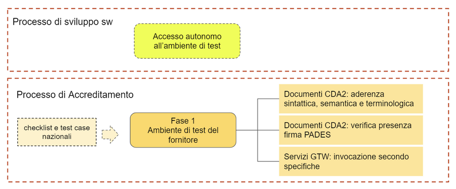

# Processo di accreditamento al FSE 2.0

# Indice

- [Processo di accreditamento al FSE 2.0](#processo-di-accreditamento-al-fse-20)
- [Indice](#indice)
- [Obiettivo del documento](#obiettivo-del-documento)
- [Processo complessivo](#processo-complessivo)
- [Fase 1: processo di accreditamento](#fase-1-processo-di-accreditamento)
  - [Test case validazione](#test-case-validazione)
  - [Test case pubblicazione](#test-case-pubblicazione)
- [Fase 2: verifica tecnica dell'impianto](#fase-2-verifica-tecnica-dellimpianto)
- [Fase 3: deployment in produzione](#fase-3-deployment-in-produzione)
  - [Notes](#notes)

# Obiettivo del documento

Il documento descrive **il processo di accreditamento** al sistema Gateway e fornisce le informazioni operative per poter effettuare i relativi test case.

Questo **documento verrà reso pubblico su Developers Italia**.

# Processo complessivo

Il processo complessivo di adeguamento e messa in produzione dell’applicativo è composto dalle seguenti fasi:

* **fase 1: accreditamento dell’applicativo software**: 
    * viene eseguito presso gli ambienti di test del fornitore al quale vengono rilasciati i certificati di test per accedere al gateway di pre-produzione; tali certificati vengono usati per l’accreditamento di tutti gli applicativi software del medesimo fornitore oggetto di accreditamento;
    * ha l’obiettivo di verificare la conformità con le specifiche nazionali;
* **fase 2:  verifica tecnica dell'impianto in azienda**:
    * viene eseguito, a discrezione della Regione/Azienda, presso gli ambienti di test dell’azienda/regione;
    * ha come obiettivo quello di verificare la conformità con le specifiche nazionali, regionali e di integrazione; 
* **fase 3:  deployment e monitoraggio in produzione**:
    * viene eseguito in ambiente di produzione presso regioni e/o aziende (_grace period_);
    * ha come obiettivo la verifica, mediante monitoraggio puntuale, della correttezza del rollout fino a quando l’impianto non raggiunge la percentuale di fault concordata.

**Processo di adeguamento dell’applicazione**

La fase di monitoraggio in produzione (grace period) chiude il processo.

# Fase 1: processo di accreditamento

La fase di accreditamento del software è propedeutica per le fasi successive e ha come obiettivo quello di verificare la conformità del software con le specifiche nazionali FSE 2.0 documentate nella sezione dedicata alla piattaforma [FSE 2.0 del sito Developers Italia.](https://developers.italia.it/it/fse/) In particolare l’accreditamento ha come oggetto:

1. verifica dell’aderenza dei documenti CDA con le specifiche nazionali:
    1. aderenze sintattiche secondo specifiche HL7 Italia;
    2. semantiche secondo gli schematron (sch) pubblicati sul git FSE di Salute; 
    3. terminologiche applicando le le specifiche e i dizionari pubblicati su git FSE Salute; 
2. verifica della corretta apposizione della firma PADES al documento; 
3. verifica della corretta invocazione di uno o più servizi  esposti dal gateway:
    4. servizio  di validazione
    5. servizio di pubblicazione

**Fase 1: processo di accreditamento**

Il processo di accreditamento **avviene presso l’ambiente di test del fornitore** ed è composto dai seguenti step:

1. Il fornitore può usare tools (containers) resi disponibili su repository git del Ministero della Salute ([it-fse-support](https://github.com/ministero-salute/it-fse-support)) a supporto dei propri sviluppi.
2. Il fornitore, richiede a Sogei certificati di test **associati al fornitore** (mediante email  all’indirizzo [fse_support@sogei.it](mailto:fse_support@sogei.it) fino a quando non sarà disponibile il sistema di provisioning che rilascerà anche i certificati di test)  per accedere ai servizi esposti dalla piattaforma gateway di test in ambiente di pre produzione (esempio: un fornitore che avvia il processo di accreditamento per due applicativi può usare il medesimo certificato). 
3. Durante la fase di sviluppo, il fornitore provvede **in forma autonoma** ad invocare i servizi del gateway al sistema di pre produzione. Questa attività consente un debugging più accurato da parte del fornitore ed è propedeutica alla richiesta di avvio dell’attività di accreditamento.
4. Conclusa la fase di sviluppo e test interno, il fornitore avvia la fase di accreditamento compilando il **form di richiesta accreditamento on line messo a disposizione da DTD**  con le seguenti informazioni:
([https://ec.europa.eu/eusurvey/runner/FSE-raccolta-id-applicativo](https://ec.europa.eu/eusurvey/runner/FSE-raccolta-id-applicativo))
   * Nome fornitore dell'applicativo
   * Nome fornitore: subject_application_vendor
   * nome applicazione: subject_application_id
   * versione applicazione: subject_application_version
   * Nome referente fornitore
   * Email referente al quale verrà inviato l'esito dei test
   * Account github per il caricamento degli esiti
   * Common name (CN) del certificato utilizzato per i test
   * data di inizio del test di accreditamento
   * data prevista di fine del test di accreditamento
   * Lista dei tipi di documento oggetto dell’accreditamento 
   * Lista servizi oggetto dell’accreditamento:
       * validazione
       * pubblicazione
1. Il fornitore accede alla lista dei test case ed esegue i test previsti nel piano di accreditamento. Quando risulteranno tutti eseguiti con esito positivo il fornitore produrrà il report dei test effettuati (`report-checklist.xlsx`) e lo caricherà nell'apposito repository github del Ministero della Salute, come indicato nel README del repository [it-fse-accreditamento](https://github.com/ministero-salute/it-fse-accreditamento). 
2. Sogei estrae i log dei test case, confronta i log con il contenuto del report `report-checklist.xlsx` e produce il report “Valutazione risultati”. 
3. Il DTD[^1] valuta il report “Valutazione risultati” prodotto da Sogei, la documentazione prodotta dai fornitori e accerta la conformità con le specifiche nazionali. Tale certificazione è propedeutica per poter programmare insieme alla Regione e/o Azienda la fase successiva del processo di adeguamento dell’applicativo (verifica tecnica dell’impianto).
Di seguito si riporta il flusso documentale a supporto del processo di accreditamento fase 1 .

**Documentazione a supporto del processo di accreditamento fase 1**

## Test case validazione

L’accreditamento  del servizio di **validazione e correttezza del CDA2** deve prevedere le seguenti tipologie di test cases:

* validazione documento con contenuti noti; 
* presenza della firma nel documento;
* invocazione del servizio di validazione del gateway secondo specifiche 

Per ogni tipologia di documento da testare **sarà resa disponibile da Sogei al  fornitore** una lista di dataset. Il fornitore userà i dataset forniti per comporre i CDA iniettati nel pdf che verranno inviati al gateway. I dataset dovranno essere coerenti con un dataset reale, anche dal punto di vista terminologico.

Il documento [`accreditamento-checklist.xlsx`](https://github.com/ministero-salute/it-fse-accreditamento/tree/main/Test%20Case) comprensivo dei dataset da utilizzare, è disponibile nel repository [it-fse-accreditamento](https://github.com/ministero-salute/it-fse-accreditamento).

Alla fine della sessione di accreditamento il fornitore dovrà fornire:

1. il report `report-checklist.xlsx` (compilando il documento `accreditamento-checklist.xlsx`) indicando per ciascun test:
    1. **timestamp** 
    2. **traceID** delle transazioni
    3. **workflowInstanceID** delle transazioni eseguite durante il piano di test
    4. identificativo del test case
    5. per i casi di test che prevedono la gestione dei casi di errore,  il messaggio di errore visualizzato dall’applicativo, la procedura che viene adottata per la sua gestione (oltre ai  riferimenti dei log come ai punti precedenti) oppure eventuali motivazioni per cui non è applicabile il test;
2. Per i software in cui la firma è oggetto di adeguamento: i PDF firmati PADES che sono prodotti durante il processo di validazione (non è necessario che i certificati di firma siano "qualificati", verrà controllata solo la corretta apposizione della firma PADES).

## Test case pubblicazione

L’accreditamento del servizio di **pubblicazione e correttezza dei metadati** di indicizzazione deve prevedere i seguenti test cases:

* pubblicazione casi di test noti;
* replace del documento;
* update metadati;
* oscuramento;
* cancellazione documento

** ** 

Si precisa che:

1. la verifica della completezza dei metadati è oggetto dei test case;
2. la  correttezza del CDA2 non è oggetto dei test case perché il sistema che pubblica tipicamente non è anche il produttore del documento;
3.  i CDA2 di test che il fornitore dovrà pubblicare e vengono forniti da Sogei e sono riconosciuti dal gateway come validati;

**Verranno forniti maggiori dettagli sul processo di accreditamento al servizio di pubblicazione nella versione successiva del documento.**

# Fase 2: verifica tecnica dell'impianto

Dopo l’accreditamento del software è possibile avviare la seconda fase di **verifica tecnica dell’impianto**, ovvero della soluzione applicativa presente all’interno dell’Azienda Sanitaria/Regione.

Anche la seconda fase viene eseguita in **ambiente di test** e si conclude con la verifica tecnica del funzionamento dell’ impianto, sulla base di un **Piano di test approntato dalla Azienda/Regione** che deve includere tutti i test previsti nella fase 1.

L’Azienda/Regione può decidere se produrre per iscritto un report e/o attivare un processo formale per tracciare le verifiche tecniche eseguite.

E’ a discrezione dell’Azienda/Regione decidere se includere nell’accreditamento della soluzione applicativa (o impianto) anche la verifica della corretta invocazione dei servizi di indicizzazione di INI.

 

Al termine del processo di verifica tecnica dell’impianto, l’Azienda/Regione dovrà produrre verso il DTD una dichiarazione di conformità con le specifiche tecniche nazionali.

# Fase 3: deployment in produzione

A seguito dell’accreditamento dell’impianto l’Azienda/Regione pianifica con il fornitore il rilascio in ambiente di produzione, che sarà monitorato per un periodo concordato con la Regione per singolo applicativo, detto “grace period”, durante il quale il fornitore dovrà porre rimedio ad eventuali anomalie che dovessero presentarsi, fino al raggiungimento della soglia di errore accettabile concordata. Solo quando la percentuale di errore dovesse risultare inferiore al valore di soglia concordata, l’impianto si intenderà collaudato.

Al fine della valutazione di questa soglia, i parametri di alimentazione e di indicizzazione vengono raccolti dal gateway ed inviati al modulo di monitoraggio che conta quindi sia il numero di documenti conformi alle specifiche che quelli non conformi.

Se non si raggiunge la soglia, il grace period si protrae oltre il periodo concordato e fino alla correzione degli errori che permettono il raggiungimento della soglia.

**Durante il grace period i documenti prodotti, anche se con esito positivo, non vengono conteggiati ai fini del calcolo degli indicatori di monitoraggio indicati nel decreto riparto**.

Durante il grace period i documenti inviati al gateway che avranno validazione positiva saranno inviati ad INI dal gateway per la loro indicizzazione, mentre quelli che hanno validazione negativa potranno comunque essere indicizzati dalla Regione tramite le modalità del FSE 1.0, per evitare disservizi nella messa a disposizione dei documenti.

Per la validazione del processo complessivo è necessario che siano in produzione anche i sistemi che pubblicano e che indicizzano. La sequenza di messa in produzione dovrebbe essere:

* adeguamento e messa in produzione del colloquio registry regionale con INI 2.0
* adeguamento e messa in produzione dei sistemi che pubblicano
* adeguamento e messa in produzione dei sistemi che producono e che validano

I sistemi che pubblicano ed i registry devono mantenere esposti, nel periodo di transizione (cioè fino al termine del grace period di tutti gli applicativi coinvolti) , sia gli endpoint FSE 1.0 che FSE 2.0.

<!-- Footnotes themselves at the bottom. -->
## Notes

[^1]:

Questa verifica da norma in fase di progettazione è in capo al DTD e sarà passata ad AGENAS e MDS una volta andata a regime. Infatti Al fine di assicurare, coordinare e semplificare la corretta e omogenea formazione dei documenti e dei dati che alimentano il FSE, l'AGENAS, d'intesa con la struttura della Presidenza del Consiglio dei ministri competente per l'innovazione tecnologica e la transizione digitale e avvalendosi di SOGEI realizza il gateway con le funzioni descritte nel 15-quater.
