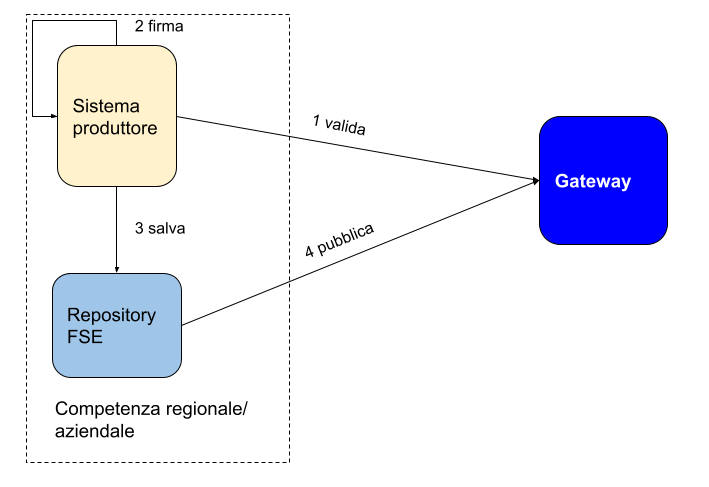

# FAQ FSE 2.0

  - [Qual è il processo di alimentazione?](#qual-è-il-processo-di-alimentazione)
  - [Cos’è la validazione?](#cosè-la-validazione)
  - [Chi valida?](#chi-valida)
  - [Cos’è la pubblicazione?](#cosè-la-pubblicazione)
  - [Chi pubblica?](#chi-pubblica)
  - [Cosa succede se il documento non passa la validazione?](#cosa-succede-se-il-documento-non-passa-la-validazione)
  - [Cosa succede se il gateway non è disponibile in fase di validazione?](#cosa-succede-se-il-gateway-non-è-disponibile-in-fase-di-validazione)
  - [Quali documenti entrano in FSE?](#quali-documenti-entrano-in-fse)
  - [In che formato sono i documenti?](#in-che-formato-sono-i-documenti)
  - [Si possono validare documenti già firmati?](#si-possono-validare-documenti-già-firmati)
  - [È possibile validare e pubblicare in un’unica transazione?](#è-possibile-validare-e-pubblicare-in-ununica-transazione)
  - [Cosa cambia rispetto all’attuale indicizzazione su INI?](#cosa-cambia-rispetto-allattuale-indicizzazione-su-ini)
  - [Quali modifiche tecnologiche regioni e aziende devono realizzare?](#quali-modifiche-tecnologiche-regioni-e-aziende-devono-realizzare)
  - [I privati devono inviare i documenti a FSE ?](#i-privati-devono-inviare-i-documenti-a-fse-)

# Processo di alimentazione dei documenti

## Qual è il processo di alimentazione?

Il processo di alimentazione si compone di 2 fasi:
* validazione
* pubblicazione

**N.B.**

1. La pubblicazione deve sempre essere **preceduta** dalla **validazione.**
2. Le modalità di realizzazione dell’’interazione tra sistema produttore e repository FSE **non** rientrano tra le indicazioni nazionali. Tuttavia è possibile applicare il profilo IHE XDS.b con la Provide and Register Document Set-b [ITI-41]

## Cos’è la validazione?

La validazione è quel processo per il quale il sistema produttore invia il documento al sistema FSE perché sia validato sintatticamente e semanticamente.

Il processo di validazione garantisce la possibilità di pubblicare il documento.

## Chi valida? 

Tutti i sistemi produttori devono **validare** il documento **prima** di apporre la firma.

## Cos’è la pubblicazione?

La pubblicazione è il processo di invio di un documento per l’alimentazione del sistema FSE.

## Chi pubblica?

La pubblicazione deve essere **successiva** alla validazione e al salvataggio del documento nel repository locale del FSE (sono necessari i metadati di riferimento al documento).

La pubblicazione verso il Gateway può essere, a questo punto, fatta dal repository FSE o altro sistema centrale o dal sistema produttore.

## Cosa succede se il documento non passa la validazione?

Se l’operatore sanitario ha la possibilità di correggere l’errore (es: anagrafica errata) è possibile ri-validare il documento dopo la correzione.

In caso contrario il processo clinico prosegue e in backoffice si valuterà se è possibile risolvere il problema e quindi pubblicare il documento. 

## Cosa succede se il gateway non è disponibile in fase di validazione?

Il processo clinico prosegue, il documento verrà firmato e memorizzato nel repository FSE. Al ripristinarsi del servizio il documento verrà validato e pubblicato.

## Quali documenti entrano in FSE?

Tutti i documenti prodotti relativi al percorso clinico definiti all’interno dell’affinity domain, che verrà progressivamente ampliato.

I documenti sono tutti i CDA2 standardizzati da HL7 Italia; la lista  aggiornata è consultabile [qui](http://www.hl7italia.it/hl7italia_D7/node/2359).

Le prescrizioni dematerializzate verranno inserite in FSE direttamente dal Sistema TS dopo averle convertite in CDA2.

## In che formato sono i documenti?

Attualmente i documenti sono pdf con iniettato il CDA2, firmati PADES.

I CDA2 possono essere iniettati nel pdf come attachment o resource.

## Si possono validare documenti già firmati?

Tecnicamente è possibile, la presenza della firma non viene controllata in fase di validazione, se la verifica dovesse trovare errori che possono essere risolti sarà necessario ri-validare il documento e apporre nuovamente la firma

## È possibile validare e pubblicare in un’unica transazione?

No, questo non è possibile, prima di pubblicare è necessario eseguire la chiamata di validazione.

## Cosa cambia rispetto all’attuale indicizzazione su INI?

Per i documenti pubblicati tramite il gateway **non** sarà più necessario inviare i metadati ad INI **né** indicizzare localmente.

Sarà il gateway ad inviare i metadati (il cui elenco sarà aggiornato e armonizzato a livello nazionale) verso INI, che li trasmetterà alla RDA, quindi occorrerà **adeguare** i nodi regionali a questa nuova logica. 

Nell’attesa che siano adeguati i sistemi regionali, sarà possibile inibire l’invio metadati verso INI da parte del gateway mantenendo il funzionamento attuale.

Il passaggio alla nuova logica di indicizzazione avverrà in accordo con la regione.

Verrà pubblicata una nuova release del documento di riferimento per le transazioni INI.

## Quali modifiche tecnologiche regioni e aziende devono realizzare?

A grandi linee gli adeguamenti necessari sono:

* Adeguare i CDA2 alle nuove specifiche.
* Produrre i documenti nel nuovo formato (CDA2 iniettato nel pdf).
* Adeguare i sistemi produttori per validare i documenti prima della firma.
* Adeguare i sistemi produttori alla firma PADES.
* Adeguare i sistemi (es: repository) per la pubblicazione dei documenti.
* Adeguare i sistemi FSE alle nuove specifiche INI.

## I privati devono inviare i documenti a FSE ?

Sì, anche i privati, accreditati e non, devono trasmettere i documenti al gateway e avere un repository proprio o una partizione/tenant all’interno del repository aziendale/regionale dove trasmettere il documento e dove saranno possibili i successivi recuperi.

INI manderà, anche in questo caso, i dati di indicizzazione alla RDA.
