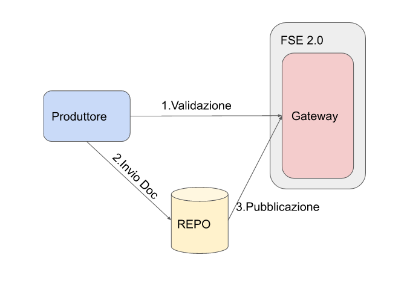
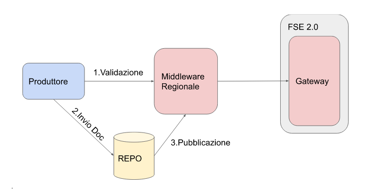
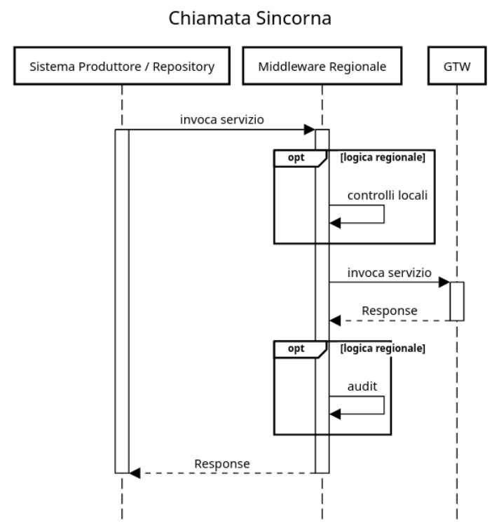
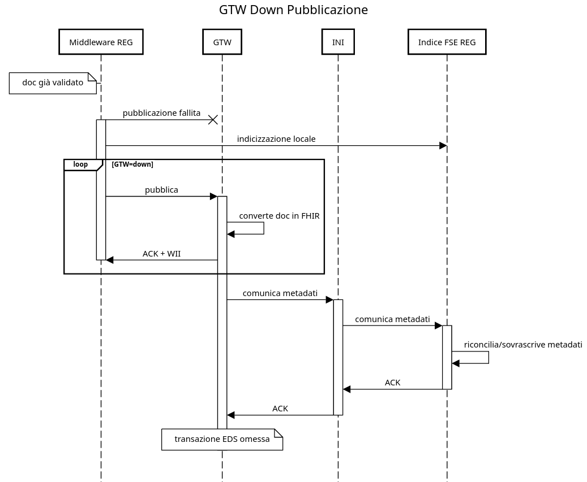

# Modello Middleware Regionale


- [Modello Middleware Regionale](#modello-middleware-regionale)
- [1. Introduzione](#1-introduzione)
- [2. Aspetti di sicurezza: gestione certificati](#2-aspetti-di-sicurezza-gestione-certificati)
  - [2.1. Caso 1 (trasporto regionale, firma produttore)](#21-caso-1-trasporto-regionale-firma-produttore)
  - [2.2. Caso 2 (trasporto e firma regionali)](#22-caso-2-trasporto-e-firma-regionali)
- [3. Aspetti di processo](#3-aspetti-di-processo)
  - [3.1. Validazione](#31-validazione)
  - [3.2. Pubblicazione/Indicizzazione](#32-pubblicazioneindicizzazione)
- [4. Ulteriori considerazioni](#4-ulteriori-considerazioni)
- [5. Conclusioni](#5-conclusioni)
- [6. Appendice](#6-appendice)
  - [Proposta codici di errore Middleware](#proposta-codici-di-errore-middleware)
  - [Proposta gestione warning Middleware](#proposta-gestione-warning-middleware)
  - [Notes](#notes)


# 1. Introduzione

Dalle interlocuzioni avute con le Regioni e le Province Autonome è sorta l’esigenza di considerare la possibilità di integrare componenti regionali nel dialogo tra i sistemi produttori e il Gateway nazionale (GTW).

Le motivazioni sono di diversa natura e non rientrano nel perimetro di questo documento.

Lo scopo è quello di definire dei principi ai quali le componenti regionali devono conformarsi per poter essere funzionali al workflow disegnato per FSE 2.0.


# 2. Aspetti di sicurezza: gestione certificati

Come noto[^1] il dialogo verso il GTW è protetto da 2 certificati X.509 utilizzati per la firma e per l’autenticazione del trasporto https.

Introducendo una componente che si frappone nel dialogo tra sistemi produttori e GTW e che “spezza” la visibilità diretta tra i software è necessario stabilire quali siano le strategie accettabili per la gestione dei certificati.



**Modello senza middleware Regionale**



**Modello con middleware Regionale**

La necessità è quella di gestire il tracciamento e la responsabilità delle chiamate verso il GTW mantenendo una coerenza logica del processo.

Tralasciando i casi tecnicamente  possibili ma non accettabili, si possono individuare sostanzialmente 2 modelli di gestione dei certificati: uno completamente in carico alla regione e uno dove invece il sistema produttore è in possesso di un certificato di firma che arriva fino al gateway.


<table>
  <tr>
   <td><strong>Caso</strong>
   </td>
   <td><strong>Certificato trasporto</strong>
   </td>
   <td><strong>Certificato Firma</strong>
   </td>
   <td><strong>Tipologia middleware</strong>
   </td>
   <td><strong>Note</strong>
   </td>
  </tr>
  <tr>
   <td>1
   </td>
   <td>regione
   </td>
   <td>produttore
   </td>
   <td>“reverse proxy”
   </td>
   <td>responsabilità del produttore
   </td>
  </tr>
  <tr>
   <td>2
   </td>
   <td>regione
   </td>
   <td>regione
   </td>
   <td>“applicativo”
   </td>
   <td>responsabilità regionale
   </td>
  </tr>
</table>


In entrambi i casi è in carico alla regione stabilire i meccanismi e le policy di autenticazione e autorizzazione del dialogo tra i sistemi produttori e il middleware regionale.


## 2.1. Caso 1 (trasporto regionale, firma produttore)

Nel caso 1 sostanzialmente il produttore è in possesso di un suo certificato, rilasciato dal sistema dal sistema di provisioning centrale, produrrà i JWT come da specifica e invocherà le API del middleware regionale.

Il middleware regionale riceverà le chiamate dai sistemi produttori, potrà applicare le sue logiche di business e in qualsiasi caso inoltrerà le chiamate verso il GTW utilizzando le [specifiche di integrazione](https://github.com/ministero-salute/it-fse-support/tree/main/doc/integrazione-gateway). **Il middleware regionale utilizzerà un proprio certificato per autenticarsi presso il gateway a livello TLS.**

Il gateway vedrà quindi una **connessione appartenente alla regione che trasporta dati e metadati firmati da un sistema produttore**.


## 2.2. Caso 2 (trasporto e firma regionali)

Nel caso 2 la regione usa propri certificati **sia per il trasporto che per la firma dei metadati inviati verso il GTW**.

Il GTW vedrà solo l’attore regionale e sarà la **regione responsabile** per quanto firmato nei token JWT. 

Si ricorda che il middleware regionale deve essere trasparente rispetto ai metadati trasportati nel JWT: **il contenuto informativo deve essere quello prodotto dal sistema produttore come se il middleware non ci fosse**.

In questa modalità non sarà necessario emettere un certificato per ogni sistema produttore e la regione dovrà dotarsi di **propri strumenti per la tracciabilità** che permettano di risalire al sistema produttore che ha originato un particolare dato.


# 3. Aspetti di processo

Per quanto riguarda il processo, il middleware regionale deve essere trasparente rispetto ai workflow definiti da specifica.

## 3.1. Validazione

In particolare devono essere garantiti:


* **Validazione sincrona**
* **Inoltro in tempo reale al gateway di tutti i messaggi ricevuti in fase di validazione e pubblicazione**

Per quanto riguarda il primo aspetto è necessario quindi che la presenza del middleware non interferisca con il processo di validazione che rimane **sincrono**.

Per **sincrono** si intende che il sistema produttore **rimane in attesa** della risposta del GTW attraverso le chiamate al middleware regionale.

Il secondo aspetto vuole garantire che **ogni** messaggio inviato verso il middleware regionale raggiunga il GTW **subito dopo la ricezione**  e che eventuali violazioni di regole regionali non comportino uno scarto verso il GTW: **ogni messaggio ricevuto deve essere passato al GTW, in generale, a livello regionale non è possibile inserire controlli bloccanti.**

Errori bloccanti sono possibili unicamente nel caso la validazione incontri condizioni che non permetteranno in un secondo momento la pubblicazione del referto, ad esempio per caratteristiche peculiari dell'infrastruttura locale, in questo caso l'errore va comunque dato **dopo** aver chiamato il servizio centrale.





**Sequence chiamata sincrona**

## 3.2. Pubblicazione/Indicizzazione

Il modello prevede che l'indice FSE Regionale sia alimentato dalle comunicazioni INI anche per gli assistiti della regione, come nello schema seguente:

<!--https://sequencediagram.org/index.html#initialData=C4S2BsFMAIEFxAW0gO2AQwF4gPYpgJIoAmIAxjAGIDKAotAEqQDmuK6UAUJwA7oBOoMiD5poAIgCyIYsSgB3ATAa0A4uOjoAztES8BQkejHjVAFQDqG7dGb7B5I2IIA5AvcOjgEoqQrQaehV1TR0QbhQcYBgoADNvHFjdAC5oYhwyWxAAA+gANw4ZdGAcTkQAWgA+ZmSeAFcAIwaEMnROdDJQAujdds6Qbpg7Ziqasjw8yEEYdMyQFACACQIGThHKxFTYAGEAaWgAamgLAndiSA6u4pg9ddcCVPHEOpRydF1IDGJi8MuB6+g90492gVWgIEeOGer1aHy+Pz6Vx64RAoMqgLcWz2nHOf0G4OBblGWN2OIu-XxQMiPRwk34tlSwH4xi0WDYMFoABFqNAoZAtKyyXiAXZuJwgA-->


Questo garantisce che le informazioni tra documenti e dati siano allineate: il Gateway implementa logiche di retry sia verso INI che verso EDS dando priorità alla consistenza delle informazioni.


Un "*response*" positivo al servizio di pubblicazione indica che il Gateway ha **preso in carico** il compito di inviare dati e metadati rispettivamente ad EDS e ad INI.


Tuttavia, nell'impossibilità di contattare il Gateway è possibile "indicizzare" temporaneamente le informazioni su sistemi interni alla regione.


Al ristabilirsi delle comunicazioni con il Gateway dovranno essere recuperate le pubblicazioni non inviate.

<!--https://sequencediagram.org/index.html#initialData=C4S2BsFMAIHEBUDq0AiB7A7gO2gBQK4BGh4IAxgIYBeIaWkAUAwA4UBOoZIrWw0ARAFkQAExFQM7GACUAorH7QKAZ2gBbFu07cKvAQkSKV0AOaaO5HXoCSAOWvntPPv2tYR5GADEAyrOhyCkqqIEwMWGjAMFAAZnxoMeoAXNAiaGSmIAAH0ABuFKQiFMBoDGoAtAAeJinMRCTk1LT00DEFpMAUDBRkoPlR6mXlAHwgKSDullRUTXTR6QWMDOBoaMxwSAC8adgM0PvqIzXQdcSklHsHPX3FMGYmR0lkdLmQHDBpGRPQXgAS1tIGA9hmoUgBBADCAGloABqaCIawOESQa4gfowDSQdxAkZ2awpZ5qfBYRrqSCdIqgbq9dG3aD4hj46AjaBjaBEklktQUihU0JojFshggEbstjkOhcUgUAD0yjQuTYKjIEte5MpxVCIBZwwZ9nB0IYKMF9NC+Me0EhUONqNpQsZEQGirephSwGVWGUsxashQPmgaB5ym9ttNAzMTCAA-->


L'indicizzazione locale è possibile anche nel caso di documento pubblicato, ma per il quale non siano arrivati i metadati da INI entro un periodo di tempo (da definire con le Amministrazioni titolari) dalla pubblicazione.

Al ricevimento della *comunicazione/aggiornamento metadati* da INI su documento indicizzato localmente questi dovranno andare a "sovrascrivere" eventuali dati locali in conflitto (caso che non dovrebbe darsi), in modo che un successivo *recupero* fornisca i metadati valorizzati come trasmessi da INI.

# 4. Ulteriori considerazioni

Di seguito ulteriori considerazioni che potrebbero essere utili.

È possibile adottare **modelli ibridi** dove ad esempio alcuni tipi di attore (es: mmg, aziende sanitarie) passano dal middleware regionale e altri no, la scelta quindi non è vincolante per tutti gli attori della regione.

È opportuno valutare attentamente le **specifiche usate internamente alla regione** anche in relazione ai costi di adeguamento.

Poiché il processo di accreditamento dei sistemi produttori prevede necessariamente la realizzazione della chiamata ai servizi del gateway, si potrebbero adottare  le specifiche nazionali anche per il colloquio tra i sistemi produttori e il middleware regionale,  in modo da poter collegare con minimi interventi software **già validati** sulla specifica nazionale. Questo modello è particolarmente adatto nel caso si decidesse per il Caso 1 nella gestione dei certificati (certificato di firma del produttore).

Verrà creato uno spazio, sotto forma di prefisso, nei messaggi di warning per le comunicazioni regionali, questo garantirà di non andare in conflitto con i warning generati a livello centrale e permetterà alla regione di veicolare messaggi di warning inerenti alle logiche locali.

Il sistema produttore sarà quindi in grado di distinguere la sorgente del warning in base al namespace.

Si ricorda che **la regione non può introdurre controlli bloccanti.**


# 5. Conclusioni

Si riassumono in sostanza i criteri che deve soddisfare il middleware regionale:


1. Adottare uno dei casi proposti per la gestione dei certificati.
2. Non alterare le fasi e le tempistiche delle validazioni sincrone.
3. Non introdurre controlli bloccanti che scartino messaggi senza che questi vengano inoltrati al GTW.

# 6. Appendice

## Proposta codici di errore Middleware

La seguente tabella propone una standardizzazione degli errori generati dai middleware regionali.

|tipo errore|type|title|status|instance|detail|
|---|---|---|---|---|---|
|Impossibilità di contattare GTW nazionale|mw/io_error|Errore comunicazione con GTW nazionale|504|*libero*|*libero*|
|Errore interno|mw/internal_error|Errore Interno|500|*libero*|*libero*|
|Errori specifici implementazione mw|mw/* |*libero*|4xx|*libero*|*libero*|

In caso di errore dal GTW nazionale, il middleware *deve* ritornare l'errore nazionale *senza aggiungere dati locali* nel body HTTP.

## Proposta gestione warning Middleware

Si propone che il middleware regionale utilizzi la stringa  `--middlewarewarning--` come prefisso dei warning generati.
Se esiste già un warning nazionale, il warning del middleware deve essere concatenato dopo quello nazionale.
es:

```json
{
  ...
"warning": "[[WARNING_EXTRACT]Attenzione, non è stata selezionata la modalità di estrazione del CDA]--middlewarewarning--warning locale"
  ...
}
```

Il prefisso `--middlewarewarning--` va inserito una volta sola nella stringa anche in caso di warning multipli, in sostanza separa i warning nazionali da quelli locali.

Anche nel caso ci sia solo warning locale è necessario inserire il prefisso `--middlewarewarning--`.


<!-- Footnotes themselves at the bottom. -->
## Notes

[^1]:
     specifiche di integrazione gateway: [https://github.com/ministero-salute/it-fse-support/tree/main/doc/integrazione-gateway#23-note-su-autenticazione-e-token-jwt](https://github.com/ministero-salute/it-fse-support/tree/main/doc/integrazione-gateway#23-note-su-autenticazione-e-token-jwt)
