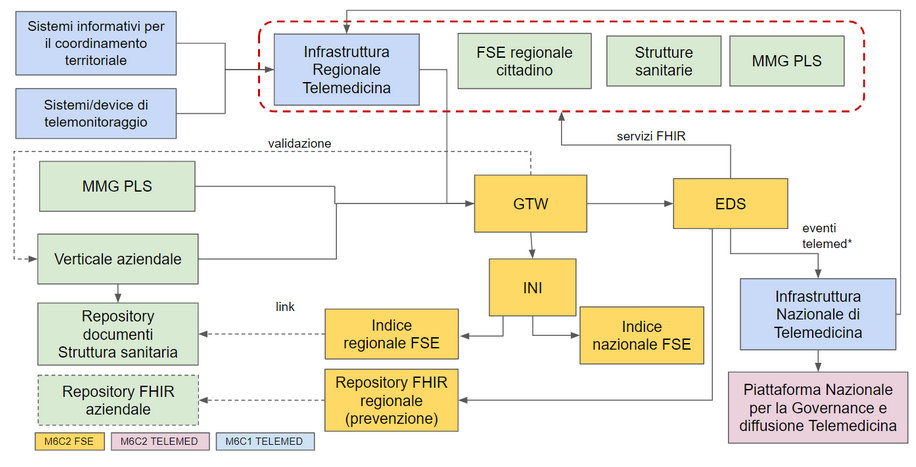
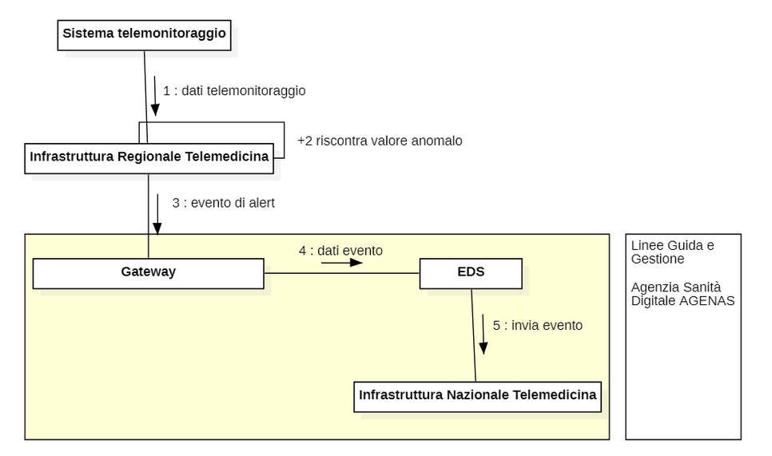
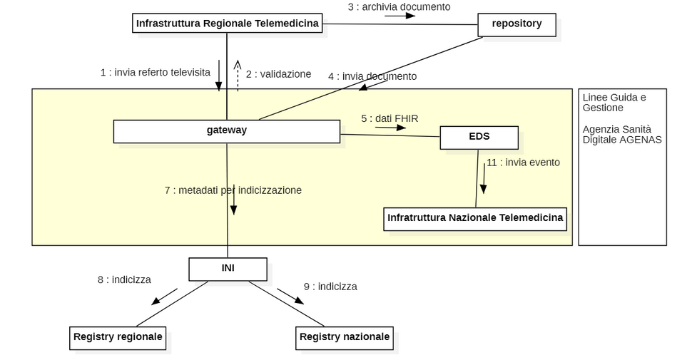

# **Piattaforma di Telemedicina ed Ecosistema FSE**

## Punti di contatto e raccordo tra i due progetti

**Indice del documento**

  - [1. Executive summary](#1-executive-summary)
  - [2. Modello di interazione](#2-modello-di-interazione)
  - [3. Dati ed eventi](#3-dati-ed-eventi)
  - [4. Servizi esposti](#4-servizi-esposti)
  - [5. Governo e propagazione delle terminologie](#5-governo-e-propagazione-delle-terminologie)
  - [6. Modello di validazione](#6-modello-di-validazione)
  - [7. Glossario](#7-glossario)

## 1. Executive summary

Il Piano nazionale di ripresa e resilienza (PNRR), attraverso la Missione 6 “Salute”, intende rendere le strutture italiane più moderne, digitali e inclusive, favorendo equità di accesso ai migliori servizi sanitari del nostro Paese per tutti i cittadini. In questo piano, la trasformazione digitale si pone come un tassello fondamentale per uniformare opportunità e standard su tutto il territorio nazionale e fonda la sua strategia su due pilastri architetturali e di processo: il nuovo **Fascicolo Sanitario Elettronico**  e la piattaforma di **telemedicina** e su una riforma:  l'Agenzia Nazionale per la Sanità Digitale (ASD). 

Il primo pilastro è quindi rendere diffuso ed uniforme sul territorio nazionale l’utilizzo e l’alimentazione del **Fascicolo Sanitario Elettronico** (FSE) da parte del cittadino e degli operatori sanitari. Affinchè ciò avvenga, il nuovo Sistema FSE nazionale dovrà essere completo nei contenuti e rappresentare il punto unico di accesso ai servizi sanitari on line. I contenuti dell’FSE (dati e documenti) saranno prodotti secondo standard internazionali, per consentire: 

* la realizzazione di meccanismi uniformi di trasmissione di dati e documenti all’FSE a livello nazionale (standard sintattico), 
* la possibilità di avere una comprensione univoca del significato del dato (standard semantico), 
* la possibilità di un confronto quantitativo sicuro dei risultati (uso delle codifiche). 

Dal punto di vista architetturale, l’obiettivo di rendere diffuso ed uniforme sul territorio nazionale l’utilizzo e l’alimentazione del FSE si raggiunge  rafforzando i meccanismi di interoperabilità della gestione documentale (Indice Nazionale), realizzando un servizio di validazione del formato del dato e del documento strettamente collegato al processo di  refertazione o in generale ai processi clinici (**Gateway**) Questi elementi permetteranno a) la conversione di documenti in dato secondo formato standard HL7 FHIR, b) la raccolta del dato e c) l’erogazione di servizi, sia con finalità di cura che di prevenzione, basati sul dato (**Ecosistema Dati Sanitari**). Il monitoraggio, in termini di quantità e verifica della qualità del dato prodotto dai sistemi produttori, è parte integrante delle funzionalità della piattaforma perché strumento di misurazione dell’utilizzo e di completezza dell’FSE, e ne guida la sua evoluzione ed efficacia in modo concreto secondo indicatori prestabiliti. I nuovi elementi che verranno realizzati - EDS e Gateway - estendono le funzionalità dell’FSE integrandone l’architettura.  Per esempio, nonostante l’FSE, nello specifico l’EDS, non realizzi di per sé servizi per finalità di programmazione e ricerca,  si prevede che vi siano  processi (esempio di pseudonimizzazione) e servizi di integrazione ed invio verso piattaforme preposte a tali finalità. 

Il secondo pilastro è il potenziamento e l’adeguamento dei **percorsi di telemedicina** per facilitare la presa in carico, acuta e cronica, da parte delle cure territoriali, favorire la deospedalizzazione e potenziare e migliorare la qualità delle cure di prossimità. I percorsi di telemedicina sono strettamente connessi con le organizzazioni delle singole aziende e regioni. Ciononostante, tali percorsi necessitano di un governo e di monitoraggio a livello nazionale in modo da garantire: l’applicazione uniforme dei workflow clinici e delle “best practice” identificate per specifici asset assistenziali, l’applicazione uniforme e soprattutto la gestione di codifiche e dizionari terminologici, la valutazione degli outcomes clinici e di processo per la verifica dell’efficacia della presa in carico mediante percorsi di telemedicina, la validazione dei dispositivi di monitoraggio da applicare nei percorsi di telemedicina. 

Dal punto di vista architetturale tale obiettivo si raggiunge realizzando una piattaforma abilitante nazionale (**Piattaforma Nazionale di Telemedicina - PNT**) che ha la funzione di governo e validazione delle soluzioni, di verifica e applicazione e manutenzione delle regole comuni di processo (workflow clinico), delle codifiche e degli standard terminologici, di valutazione degli outcomes di utilizzo, sia per fini rendicontativi, che clinici. La piattaforma abilitante di telemedicina è connessa con i verticali **di telemedicina** **regionali **interoperabili tra loro che, integrati nei processi delle aziende sanitarie e con MMG/PLS, realizzano i **servizi minimi di telemedicina** (televisita, teleconsulto, telemonitoraggio, teleassistenza) e costituiscono l’infrastruttura regionale di telemedicina. L’infrastruttura regionale di telemedicina è unica a livello regionale e interoperabile con quelle delle altre regioni grazie all’integrazione con la piattaforma nazionale di telemedicina. L’infrastruttura regionale di telemedicina garantisce anche la possibilità di modellare e applicare workflow efficaci nel contesto specifico di applicazione aziendale, previo processo di validazione e controllo degli standard e requisiti di integrazione da parte della piattaforma abilitante di  telemedicina. 

La riforma abilitante è costituita dalla nascente Agenzia Nazionale per la Sanità Digitale (ASD). Nella fase  di  attuazione  del  Piano  nazionale  di ripresa e resilienza e  comunque  non  oltre  il  31  dicembre  2026, AGENAS esercita le funzioni, tra le altre, di  predisposizione e aggiornamento delle linee guida e monitoraggio della loro attuazione, promozione e realizzazione di servizi sanitari e socio sanitari basati sui dati, validazione delle soluzioni digitali, gestione della piattaforma nazionale di telemedicina avvalendosi  del  supporto  della  struttura  della  Presidenza  del  Consiglio   dei   ministri    competente   per l'innovazione tecnologica e la transizione digitale mediante la stipula di un’apposita convenzione.

Le piattaforme FSE e di telemedicina sono mutuamente connesse e concorrono nel realizzare processi clinici, di governo anche tecnologico, di raccolta dati e  messa a disposizione di servizi verso i cittadini e verso i professionisti, appoggiandosi su strutture cloud e logiche a microservizi. Tale impostazione tecnologica abilita il riuso di servizi e funzioni comuni alle due piattaforme e un governo più efficace o operativo del processo di riuso di nuovi servizi che potranno aggiungersi a quelli essenziali indicati ad oggi nelle linee guida di attuazione. 

In aggiunta alla raccolta dei documenti e dei dati, la progettazione e realizzazione progressiva della **gestione degli eventi,** sulle due piattaforme, è propedeutica a questa visione di prospettiva, ma è anche funzionale nel fornire a breve-medio periodo servizi basati sul dato concretamente più evoluti rispetto a quelli basati sul documento. Ciò deve essere quindi indirizzato già nelle prime fasi progettuali.

La naturale evoluzione delle due piattaforme, dopo l’attuazione del PNRR, va nella direzione di divenire un’unica architettura tecnologica che, per garantire la massima inclusione degli attori del mercato riducendo quindi il “lock in” e per favorire il governo e l’evoluzione  della piattaforma tecnologica da parte dell’Agenzia della Sanità Digitale, si promuoveranno, laddove possibile, l’adozione, per lo sviluppo delle due piattaforme, di paradigmi open source e più in generale di soluzioni realizzative atte a ridurre la dipendenza tecnologica.  Si promuoverà inoltre il ricorso a soluzioni software che consentano la personalizzazione degli strumenti necessari a ASD- AGENAS per esercitare le funzioni di governo, monitoraggio e gestione delle piattaforme di telemedicina e di FSE.

La piattaforma FSE sarà abilitante per la raccolta dei dati e documenti e per l’erogazione di servizi “non specializzati" (cioè non incardinati in workflow di presa in carico specifici) verso cittadini e  professionisti sanitari. La piattaforma di telemedicina, invece, dovrà via via realizzare tutti i servizi, identificati e futuri, di presa in carico territoriale e domiciliare. 

## 2. Modello di interazione

Il sistema FSE raccoglie tramite il gateway documenti, dati ed eventi prodotti dai soggetti erogatori, mantenendo la struttura federata degli Indici (Registry) per la gestione documentale e introducendo la gestione di dati ed eventi tramite l’EDS, che offre sia componenti di memorizzazione (Data Repository) che un layer di servizi per l’accesso al dato. Le piattaforme regionali di telemedicina alimentano l’FSE al pari dei sistemi produttori e utilizzano i servizi di consultazione; la Piattaforma Nazionale di Telemedicina (PNT) ed EDS sono integrati per lo scambio dei dati di comune interesse.

Il Fascicolo Sanitario Elettronico è una piattaforma che eroga **servizi** verso il cittadino ed i professionisti sanitari,  gestisce **dati** e **documenti** prodotti da soggetti erogatori pubblici e privati e il consenso informato nel rispetto delle norme GDPR. 

La gestione documentale è realizzata: dagli Indici (Registry) regionali che indicizzano i documenti memorizzati presso i sistemi informativi delle strutture sanitarie e dall’Infrastruttura Nazionale per l’Interoperabilità (INI) e dall’Indice (Registry) nazionale, che consentono l’accesso ai documenti da una regione diversa da quella di produzione del dato e abilitano le funzioni di trasferimento degli indici dei documenti che costituiscono il fascicolo.

La gestione dei dati e l'erogazione dei servizi viene invece realizzata dall’**Ecosistema Dati Sanitari (EDS)** che contiene dati atomici anche personali secondo standard internazionale HL7-FHIR e realizza servizi secondo processi di erogazione regolati sempre dallo standard HL7-FHIR. Il Ministero della salute e' titolare  del trattamento dei dati raccolti e generati dall'EDS,  la  cui  gestione operativa e' affidata all'AGENAS.

Tramite l’EDS è possibile  realizzare interoperabilità di processi, anche transfrontalieri, basati su standard sia a livello di dato che di processo. L’EDS realizza servizi per le finalità di cura e di prevenzione, anche personali (medicina di iniziativa e di precisione). Le Regioni possono, opzionalmente predisporre repository regionali per fini di prevenzione, con il medesimo data model FHIR dall’EDS, ed essere alimentati da EDS mediante meccanismi di sincronizzazione.

**Il Gateway** assicura che i documenti ed i dati prodotti nativi digitali dai dipartimentali delle strutture sanitarie, siano conformi agli standard e ai dizionari terminologici e traduce i documenti dallo standard HL7 CDA2 allo standard FHIR, oltre ad assicurare che i metadati che compongono l’indice degli Indici/Registry regionali e Nazionale siano conformi alle specifiche nazionali di interoperabilità.

La Piattaforma Nazionale di Telemedicina in Cloud è composta da due componenti, integrate ma chiaramente distinte nel processo di esecuzione : 

• **Infrastruttura Regionale di Telemedicina** (indicata nell’allegato “indicazioni metodologiche per la perimetrazione delle proposte di PPP per la piattaforma nazionale di telemedicina” come **servizi minimi**) che, nelle sue istanze regionali, realizza almeno i servizi minimi della Piattaforma Nazionale di Telemedicina;

• Piattaforma/**Infrastruttura Nazionale di Telemedicina** (**PNT**) che, gestita da Agenas,  è costituita dai  **servizi abilitanti** di cui all’avviso PPP pubblicato sul sito di Agenas. 

L’Infrastruttura **Regionale** **di telemedicina** è un insieme di verticali che, tramite il gateway, alimentano EDS e l’FSE con dati, documenti ed eventi legati ai percorsi di telemedicina. Gli eventi caratterizzano i contesti di asset assistenziale in cui i dati e documenti sono prodotti e sono definiti tramite un set di dati. Rappresentano ad esempio l’inizio e la fine di un percorso assistenziale che si protrae nel tempo ma anche un evento puntuale, come una visita o la segnalazione di un valore anomalo. Essi sono utili per:

* il professionista medico per poter realizzare servizi di accesso al dato più efficaci , in particolar modo per assistiti complessi o comunque con comorbilità, 
* l’assistito consentendo l’organizzazione dei dati e documenti sul proprio FSE in modo più adatto alle esigenze specifiche.

Il verticale regionale di telemedicina realizza almeno i servizi di telemedicina minimi applicando standard per la produzione dei dati e documenti secondo le Linee Guida FSE, applica codifiche e workflow di processo secondo quanto previsto dalla Linee Guida Telemedicina che sono verificate dall’Infrastruttura nazionale di telemedicina con il quale è integrato. Inoltre si integra con i servizi centrali, di autenticazione, prenotazione e pagamento delle prestazioni.

_Modello logico di interazione a regime_

L’infrastruttura **nazionale di telemedicina **è uno strumento di programmazione e governo, anche clinico, e assolve tra gli altri:

* compiti di governo, pianificazione e monitoraggio dei servizi e dei processi di telemedicina anche funzionali alla diffusione attraverso la piattaforma nazionale per la governance e diffusione della telemedicina,
* monitoraggio e valutazioni sugli outcome di efficacia ed efficienza dei processi clinici assistenziali,
* monitoraggio e verifiche dell’applicazione delle regole di workflow e dell’utilizzo delle corrette terminologie,
* supporto al processo di validazione delle soluzioni telemedicina diffuse attraverso la piattaforma nazionale per la governance e diffusione della telemedicina.

Per assolvere ai propri compiti, l’infrastruttura  nazionale di telemedicina realizza un motore di workflow,  recupera i dati necessari e gli eventi dall’EDS restituendo all’EDS informazioni aggiuntive relativi ai processi di telemedicina.

L’infrastruttura nazionale non interviene nel processo clinico di erogazione delle prestazioni di telemedicina ed i servizi di monitoraggio sono da essa disaccoppiati. Ne consegue che l’infrastruttura nazionale non assume le caratteristiche di dispositivo medico e non è soggetta a certificazione.  La modalità di acquisizione degli eventi è asincrona.

## 3. Dati ed eventi

**Memorizzazione dati  di telemedicina su EDS**

L’EDS memorizza dati ed eventi provenienti dai verticali regionali di telemedicina. 

I dati prodotti in regime di telemonitoraggio continuo prodotti dai dispositivi medici possono essere ingenti e non tutti rilevanti al di fuori dell’evento di monitoraggio. Il verticale regionale di telemedicina memorizza tutti i dati di monitoraggio. Quando un dato di telemonitoraggio presenta un valore critico o di particolare rilievo, viene generato un evento di alert, gestito nell’ambito dei percorsi di telemedicina, e inviato ad EDS insieme ai dati correlati all’evento. Ciò assicura l’alimentazione dell’EDS con i dati di rilievo tralasciando la memorizzazione di tutto lo storico alla periferia.

Nella figura seguente è mostrato un esempio di gestione nelle due piattaforme dei dati di telemonitoraggio.

_esempio di alimentazione evento alert telemonitoraggio_

I reperti (es. diagnostica per immagini) rimangono memorizzati presso i sistemi di conservazione aziendale, vengono messi a disposizione meccanismi di recupero mediante link associati ai dati correlati sia dai verticali di telemedicina che dai servizi di EDS e sono quindi a disposizione anche della PNT.

Nella figura seguente è mostrato un esempio di alimentazione nelle due piattaforme di un referto di televisita.  Il referto prodotto viene sottoposto al gateway per una validazione sintattica e semantica, in seguito alla quale viene memorizzato nel repository documentale e quindi inviato al gateway per la conversione in FHIR, che ne permette la memorizzazione e gestione su EDS, e per l’indicizzazione sui Registry. L’EDS provvede infine a comunicare alla Infrastruttura Nazionale di Telemedicina l’evento.

Il processo di validazione effettuato dal gateway avverrà applicando controlli progressivamente stringenti, tenendo conto del grado di maturità e adeguamento delle soluzioni di mercato.

_esempio di alimentazione referto di televisita_

L’Infrastruttura Nazionale Telemedicina acquisirà da EDS i dati prodotti dalla Infrastruttura Regionale di Telemedicina necessari per poter svolgere le funzioni di governo e monitoraggio. Per questa finalità sarà presente un layer per la gestione delle logiche operazionali sui dati e la creazione di cruscotti di analisi, un layer per la gestione degli eventi e un layer di persistenza di dati pseudonimizzati e clusterizzati di tutte le Regioni e rispondenti alle finalità dei servizi abilitanti ferma restando l’origine dei dati dall’EDS

**Gestione degli eventi**

Gli eventi sono informazioni memorizzate su EDS. Gli eventi di telemedicina sono prodotti dai verticali regionali di telemedicina e, tramite il gateway, anch’essi inviati ad EDS. Quest’ultimo, mediante meccanismo di subscription, riconosce gli eventi di telemedicina e li invia alla Infrastruttura Nazionale di Telemedicina affinché possa espletare le funzioni di verifica e governo.  

Gli eventi rappresentano una necessità nel breve periodo per il corretto monitoraggio delle attività da parte della PNT, ma sono di interesse anche per l’EDS, ad esempio per la riconduzione dei dati prodotti all’interno dello stesso episodio e il tracciamento del percorso del paziente. Gli eventi rappresentano l'inizio/fine di un percorso o di un episodio e sono individuati da una struttura dati che contiene informazioni che caratterizzano il particolare evento, il sorgente e a chi è indirizzato. Un evento può innestarsi in un altro evento che viene indicato come padre. Il riferimento all’evento deve essere presente anche nei documenti/dati prodotti in relazione all’evento stesso. Ciò richiede un adeguamento da parte dei dipartimentali coinvolti nel servizio di telemedicina, le cui specifiche tecniche devono essere indirizzate all’interno della progettazione della Piattaforma Nazionale di Telemedicina.

La PNT,  tra le sue funzioni, ha anche il compito di validare il workflow individuato dagli eventi. Tale validazione avviene in modo asincrono e prevede un ritorno verso le aziende secondo un processo di back office. La PNT rappresenta l’elemento autoritativo per la gestione degli eventi della telemedicina_. _L’EDS, per il tramite del gateway, raccoglie tutti gli eventi. Sono necessari meccanismi per l’identificazione del tipo di evento ed in particolare per individuare quelli di interesse per la PNT (eventi di telemedicina ed eventi di assistenza domiciliare[^1]), che dovranno poi essere condivisi con la PNT per il monitoraggio e la validazione del workflow.

## 4. Servizi esposti

Il FSE, nello specifico EDS, mette a disposizione i servizi di consultazione di dati e documenti da parte di cittadini e di professionisti sanitari. La consultazione è possibile sia tramite touchpoint sia tramite integrazione applicativa. Sono messi a disposizione del FSE anche servizi a supporto della prevenzione individuale e dei processi di Value Based Healthcare. Lo specialista che prende in carico un assistito nell’ambito della telemedicina ha necessità di consultare la documentazione clinica del paziente. I sistemi di telemedicina, analogamente agli applicativi utilizzati dai professionisti sanitari, potranno integrarsi con i servizi di consultazione dei dati messi a disposizione del FSE, evitando in questo modo la duplicazione dei dati e le richieste di caricamento della documentazione da parte del paziente.

Il FSE si pone inoltre come canale unico di accesso per il cittadino per i servizi sanitari, non solo relativi alla consultazione dei documenti, ma anche per il caricamento dei dati (taccuino e i cosiddetti Personal Generated Health Data PGHD) e per i servizi come ad esempio la prenotazione e il pagamento delle prestazioni. I processi di telemedicina che vedono coinvolto il paziente in una di queste azioni, passeranno quindi attraverso il FSE. Il FSE sarà inoltre il punto di aggregazione per app certificate nell’ambito della telemedicina per percorsi specifici, come ad esempio la compilazione di questionari dedicati o la consultazione o l’inserimento di dati relativi a particolari percorsi (telemonitoraggio, altro).

Infine l’FSE, e il PNT, realizzano servizi di monitoraggio esponendo dashboard per i bisogni specifici e sulla base dei dati presenti su EDS e su PNT. 

## 5. Governo e propagazione delle terminologie

Sia la piattaforma di telemedicina nazionale che il FSE necessitano di un servizio di gestione delle terminologie e codifiche adottate. Tra le terminologie gestite rientrano anche quelle relative agli eventi. Il sistema di propagazione e di aggiornamento delle terminologie sarà unico per FSE e PNT, ma vista la specificità delle terminologie che vengono adottate in ambito di telemedicina potrebbe essere opportuno adottare un modello federato di gestione delle terminologie ove l’Infrastruttura Nazionale di Telemedicina è un nodo di gestione terminologico che, per i processi di distribuzione e adozione sui sistemi coinvolti, faccia riferimento all’infrastruttura di gestione codifiche dell’EDS.

## 6. Modello di validazione

La PNT e l’FSE devono dotarsi di processi e ambienti tecnologici per  supportare il processo di validazione di:

* soluzioni regionali di telemedicina che saranno adottate (anche per i servizi non inclusi nell’insieme dei servizi minimi di telemedicina) al fine di verificare la corretta alimentazione, attraverso il gateway, di EDS e degli indici (registry) regionali e nazionali;
* applicativi dipartimentali delle strutture sanitarie, applicativi per la gestione delle cartelle dei MMG/PLS al fine di verificare la corretta alimentazione, attraverso il gateway, di EDS e degli indici (registry) regionali e nazionali;
* applicativi dipartimentali delle strutture sanitarie  per verificare l’accesso, mediante layer dei servizi di EDS,  a dati e servizi.

I processi di validazione relativi alla telemedicina riguardano la verifica tecnica delle soluzioni di mercato delle infrastrutture regionali di telemedicina, anche per servizi non inclusi nel set minimo, e la verifica che le soluzioni di telemedicina (device più software) possiedano i requisiti di certificazione come medical device laddove previsto dalla normativa vigente. Tali processi sono da applicare sia per nuovi applicativi, che interagiranno con le infrastrutture di telemedicina ed FSE, sia per nuovi servizi che andranno ad arricchire le infrastrutture regionali di telemedicina e sia per le nuove funzionalità di monitoraggio e governo dell’infrastruttura nazionale di telemedicina. Dovranno quindi essere predisposti processi ed ambienti tecnologici a supporto di questa attività. Stante l’architettura, l’attività di validazione dell’integrazione delle infrastrutture regionali di telemedicina con l’infrastruttura nazionale coinvolgerà la validazione dell’intera “catena” Gateway-EDS-infrastruttura nazionale di telemedicina oltre agli indici regionali e nazionali.

## 7. Glossario

<table>
  <tr>
   <td>
FSE
   </td>
   <td>Fascicolo sanitario elettronico, istituito ai sensi delle disposizioni dell’articolo 12 del decreto-legge 18 ottobre 2012, n. 179, convertito, con modificazioni, dalla legge 17 dicembre 2012, n. 221, e successive modificazioni
   </td>
  </tr>
  <tr>
   <td>EDS
   </td>
   <td>Ecosistema Dati Sanitari istituito ai sensi del comma 15-quater dell’articolo 12, comma 15-quater del decreto-legge 18 ottobre 2012, n. 179, convertito, con modificazioni, dalla legge 17 dicembre 2012, n. 221, e successive modificazioni
   </td>
  </tr>
  <tr>
   <td>Gateway
   </td>
   <td>Componente tecnologico che implementa le funzioni di cui all’articolo 12, comma 15-quater, lettere a), b) e c), del decreto-legge 18 ottobre 2012, n. 179, convertito, con modificazioni, dalla legge 17 dicembre 2012, n. 221, e successive modificazioni, al fine di alimentare in modo omogeneo a livello nazionale il FSE e l’EDS
   </td>
  </tr>
  <tr>
   <td>INI
   </td>
   <td>Infrastruttura nazionale per l’interoperabilità fra i FSE, istituita ai sensi del comma 15-ter dell’articolo 12 del decreto-legge 18 ottobre 2012, n. 179, convertito, con modificazioni, dalla legge 17 dicembre 2012, n. 221, e successive modificazioni, realizzata dal Ministero dell’economia e delle finanze, della quale lo stesso assume la titolarità del trattamento dei dati
   </td>
  </tr>
  <tr>
   <td>Indice Nazionale FSE
   </td>
   <td>Indice nazionale dei documenti dei FSE,  al fine di assicurare in interoperabilità le funzioni del FSE, parte di INI, istituito ai sensi del comma 15-ter, punto 4-ter) dell’articolo 12 del decreto-legge 18 ottobre 2012, n. 179, convertito, con modificazioni, dalla legge 17 dicembre 2012, n. 221, e successive modificazioni
   </td>
  </tr>
  <tr>
   <td>MMG/PLS
   </td>
   <td>Medici di medicina generale e pediatri di libera scelta;
   </td>
  </tr>
</table>

<!-- Footnotes themselves at the bottom. -->
## Notes

[^1]: La PNT è interessata a ricevere comunicazione di tutti i percorsi di assistenza domiciliare, indipendentemente dall’attivazione al loro interno di processi di telemedicina, in quanto rappresentano il denominatore nelle valutazioni di efficienza.
