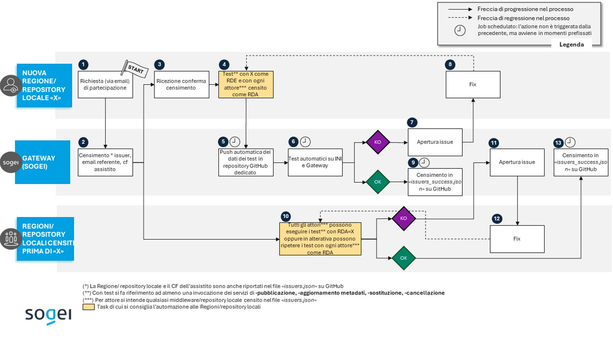

## Glossario

|Acronimi | Definizioni|
|:----:|----|
|RDA|Regione Di Assistenza di un assistito |
|RDE|Regione Di Erogazione di una prestazione sanitaria ad un assistito |
|MDW|Middleware Regionale |
|GTW|Gateway |
|INI|Infrastruttura Nazionale per l’Interoperabilità del Fascicolo Sanitario Elettronico |

## Introduzione

Il Crash Program è un'iniziativa strategica volta a migliorare l'efficienza e l'affidabilità delle interazioni tra i servizi ICT regionali e i sistemi nazionali di gestione dei dati sanitari. Questo programma si concentra sulla standardizzazione e sull'automatizzazione dei processi di scambio dati, garantendo una maggiore sicurezza e una riduzione degli errori umani.

In questo contesto, il responsabile dei servizi ICT Regionale o di un Document Repository svolge un ruolo cruciale. Egli invia una comunicazione esprimendo la volontà di aderire al Crash Program. Attraverso l’automatizzazione delle richieste dal Middleware Regionale (MDW) piuttosto che dal repository locale verso il Gateway (GTW)[^1], si garantisce un processo continuo e affidabile che può essere adattato alle esigenze di una crescente rete di Regioni/repository locali e di partecipanti.

L'obiettivo finale del Crash Program è quello di costruire un'infrastruttura robusta che garantisca la corretta gestione e l'interoperabilità dei dati sanitari, migliorando la qualità del servizio e la sicurezza dei dati per i cittadini, e fornendo una base solida per future espansioni e miglioramenti tecnologici.

[^1]: L’arruolamento al Crash Program è possibile sia per i Middleware Regionali (MDW) che per i repository locali. I primi però vengono considerati ad un livello gerarchicamente superiore rispetto agli altri, per cui, nel caso in cui una Regione abbia censito un Middleware, non sarà consentita l’adesione al programma da parte di altri document repository afferenti alla stessa Regione; viceversa, in caso di assenza di un MDW, sarà possibile la partecipazione per i document repository regionali.

## Descrizione del processo


_Figura 1 - Flow del processo del Crash Program_

Di seguito viene descritto nel dettaglio il processo, rappresentato in Figura 1, a partire dalla richiesta di adesione al Crash Program fino alla sua conclusione. Si segnala che, per lo svolgimento del Crash Program, il repository di riferimento è accessibile al link [it-fse-gtw-crash-program](https://github.com/ministero-salute/it-fse-gtw-crash-program/tree/main):

1. La Regione/repository locale che intenda partecipare al Crash Program deve inviare una richiesta di partecipazione via e-mail all’indirizzo [fse_support@sogei.it](mailto:fse_support@sogei.it), fornendo tutte le informazioni necessarie per l’abilitazione (si rimanda agli esempi a seguire “Esempio di invio e-mail per middleware” e “Esempio di invio e-mail per non middleware”)
2. Sogei provvede al censimento dell’issuer (che sarà abilitato a comunicare con INI ai fini del Crash Program), della e-mail, del codice fiscale dell’assistito. Tali dati saranno anche resi disponibili sul file GitHub “issuers_success.json”. Al termine, viene fornita conferma dell’avvenuto censimento alla stessa e-mail del referente indicata nella richiesta iniziale.
3. Il referente della nuova Regione/repository locale che desideri partecipare al Crash Program riceve via e-mail la conferma dell’avvenuto censimento.
4. La nuova Regione/repository locale, una volta abilitata a partecipare al Crash Program, effettua i test con il ruolo di RDE, prendendo come RDA, una alla volta, tutte le altre Regioni/repository locali censite fino a quel momento (disponibili, con il relativo CF dell’assistito sul file GiHub issuers.json). I test in questione prevedono l’invocazione di ognuno dei seguenti servizi: creazione, aggiornamento metadati, sostituzione e cancellazione. Per l’esecuzione dei test in questione, è consigliata la predisposizione di un automatismo.
5. Tramite un job dedicato, avviene in automatico la pubblicazione dei dati riferiti ai test sul repository GitHub [it-fse-gtw-crash-program](https://github.com/ministero-salute/it-fse-gtw-crash-program/tree/main) dedicato.
Tali dati vengono resi disponibili sul file disponibile al seguente percorso:
`/[REGIONE]/[REPOSITORY LOCALE]/integrity:[ISSUER].csv`. 

    Dove:

    - REGIONE: rappresenta la Regione appena censita ai fini del Crash Program,
    - REPOSITORY LOCALE: livello facoltativo, che rappresenta il repository locale che fa capo alla Regione X. Dal momento che i repository documentali locali possono essere abilitati ai fini del Crash Program solo in assenza di un middleware relativo alla Regione in questione, nel caso in cui la Regione X ne sia sprovvista, tale livello sarà assente nell’alberatura.
    - ISSUER: campo del token di signature con la seguente espressione regolare `integrity:S1#[CN].csv`, dove per CN si intende il common name attribuito da Sogei per la generazione dei certificati.

6. Tramite un job dedicato, vengono eseguiti dei controlli automatici sul Gateway e INI per verificare l’esito delle invocazioni eseguite dalla Regione/repository locale X.
7. Nel caso in cui l’esito dei test automatici sia negativo, viene aperta in automatico una issue da parte dei servizi Sogei, che riporta nel titolo le Regioni/repository locali coinvolte (come RDE e RDA) nell’invocazione che ha dato luogo ad errore. Ai referenti viene inviata anche un’e-mail per notificare l’apertura della issue. Nel caso in cui fosse necessario segnalare un errore che non abbia originato l’apertura di una segnalazione da parte dell’automatismo, i referenti hanno la possibilità di aprire una issue in autonomia al [link](https://github.com/ministero-salute/it-fse-gtw-crash-program/issues).
8. I referenti regionali prendono atto della segnalazione, eseguono un’eventuale fix e il processo verrà ripetuto a partire dal punto 4.
9. Nel caso in cui l’esito dei test automatici sia positivo, avviene il censimento nel file issuers_success.json (presente sul repository GitHub) della RDE che ha superato con successo tutti i test (creazione, aggiornamento metadati, sostituzione e cancellazione), con le altre Regioni/repository locali nel ruolo di RDA.
10. Le Regioni/repository locali censite prima dell’avvento di “X” dovrebbero quindi eseguire i test (creazione, aggiornamento metadati, sostituzione e cancellazione) con la Regione/repository locale X in qualità di RDA e loro stesse in qualità di RDE. A tale scopo alle Regioni/repository locali si consiglia di ricorrere all’automatismo di cui al punto 4, avendo cura di limitare opportunamente la lista di Regioni/repository locali in perimetro. In alternativa, è possibile impiegare l’automatismo di cui al punto 4 per rieseguire i test sul perimetro completo delle Regioni/repository locali censiti. Saranno così testate in maniera efficiente, tutte le Regioni/repository locali che si saranno aggiunte in qualità di RDA.
11. Nel caso in cui l’esito dei test sia negativo, viene aperta in automatico una issue da parte dei servizi Sogei, che riporta nel titolo le Regioni/repository locali coinvolte (come RDE e RDA) nell’invocazione che ha dato luogo ad errore. Ai referenti viene inviata anche un’e-mail per notificare l’apertura della issue.
12. L’issue aperta dovrà essere prima risolta per poter ripetere nuovamente i test (punto 10).
13. Nel caso in cui l’esito dei test sia positivo, verrà aggiornato il timestamp dell’oggetto json riferito alle Regioni/repository locali (nel ruolo di RDE) presente nel file issuers_success.json nel medesimo repository GitHub.

### Prerequisiti

Per aderire al Crash Program è necessario essere in possesso dei seguenti prerequisiti:

1.	Automatismo (consigliato): la Regione/repository locale che intenda partecipare al Crash Program dovrebbe implementare un batch per l’esecuzione delle invocazioni ai servizi di creazione, aggiornamento metadati, sostituzione e cancellazione, con la Regione/repository locale stessa fissa nel ruolo di RDE, iterando su un array di Regione/repository locale nel ruolo di RDA. L’array in questione può essere configurato diversamente a seconda dello step di processo (si rimanda ai punti 4 e 10 della sezione riportata sopra).
2.	Ottenimento dei certificati del Crash Program: per essere censiti nel Crash Program è necessario richiedere nuovi certificati. Per il loro ottenimento, occorre inviare una e-mail a [fse_support@sogei.it](mailto:fse_support@sogei.it) con allegate due CSR: si prega di specificare nel nome della CSR a quale dei certificati è associato (auth o signature). Si evidenzia che Il common name sarà composto secondo il seguente pattern:

    - `A1#<Codice Regionale>#<Identificativo Certificato>`
    - `S1#<Codice Regionale>#<Identificativo Certificato>`

    dove: `<Codice Regionale>` deve essere valorizzato secondo il value set definito in tabella 4.1-2 di Affinity Domain v2.5 e `<Identificativo Certificato>` è un testo libero nel quale è necessario indicare un rifermento della Regione/repository locale che partecipa al Crash Program.
    Di seguito alcuni esempi: REGIONE SARDEGNA, MIDDLEWARE200, 200REGIONESARDEGNA-TEST.
    Dopo aver inviato le CSR come da indicazioni, verranno creati i due certificati (auth e signature), così come specificato in [Documentazione - richiesta certificati](https://github.com/ministero-salute/it-fse-support#richiesta-certificati-x509).

3. Abilitazione Sharepoint Crash Program: la richiesta di abilitazione allo Sharepoint del Crash Program deve essere inviata alla seguente e-mail: [fse-pnrr-comunicazioni@innovazione.gov.it](mailto:fse-pnrr-comunicazioni@innovazione.gov.it).
4. Abilitazione Anagrafiche Crash Program: per l’abilitazione delle anagrafiche da utilizzare ai fini del Crash Program (che devono essere complete di codice Fiscale e dati anagrafici associati) è necessario inviare una e-mail a [gestioneTS@sogei.it](mailto:gestioneTS@sogei.it).
5. Censimento della Regione/repository locale: per il censimento: il responsabile del sistema da includere al Crash Program dovrà inviare una mail alla casella di posta [fse_support@sogei.it](mailto:fse_support@sogei.it) specificando il common name, l’e-mail del referente e l’anagrafica dell’assistito, come negli esempi riportati di seguito:

:::note[Esempio di invio email per middleware]    
**to**: fse_support@sogei.it  
**subject**: Adesione crash program MDW Regione Y  
Io sottoscritto Mario Rossi, desidero aderire al crash program. Di seguito i riferimenti da utilizzare:  
**Paziente**: GCMVRD92X19L259X(Giacomo Verdi)   
**Cn**: A1#1234TEST  
**Middleware**: SI  
**Email referente**: referenteMDW@test.it  
:::

:::note[Esempio di invio email per non middleware]    
**to**: fse_support@sogei.it  
**subject**: Adesione crash program MDW repository locale Y  
Io sottoscritto Mario Rossi, desidero aderire al crash program. Di seguito i riferimenti da utilizzare:  
**Paziente**: GCMVRD92X19L259X(Giacomo Verdi)   
**Cn**: A1#1234TEST  
**Middleware**: NO  
**Email referente**: referenteMDW@test.it  
**Document repository**: ASL_NA_3_SUD
:::

La richiesta di cui al punto 5) verrà presa in carico dall’operational che al termine delle opportune verifiche fornirà un feedback via e-mail circa l’avvenuto censimento. Si specifica inoltre che, nel caso in cui una Regione sia dotata di un Middleware, non sarà consentita l’adesione al programma da parte di altri document repository; viceversa, sarà possibile la partecipazione per i document repository regionali.

:::note[Esempio di automatizzazione]
Il punto 1 dei requisiti, sebbene non mandatorio, è fortemente consigliato dal momento che, se le diverse chiamate non venissero automatizzate, la scalabilità verrebbe fortemente ridotta.

### Automazione del processo

Per garantire una soluzione che risulti significativamente scalabile, per l’esecuzione dei test (step 4 e 10 del processo), il client dovrebbe essere progettato per gestire in maniera efficiente una lista dinamica di codici fiscali, i quali appartengono a cittadini dislocati in varie Regioni geografiche (RDA): in generale è consigliata la predisposizione di un automatismo per invocare i servizi richiesti (creazione, aggiornamento metadati, sostituzione e cancellazione, descritti nel documento di integrazione Gateway) con la Regione/repository locale chiamante fissa nel ruolo di RDE e variando di volta in volta la Regione/repository locale nel ruolo di RDA tramite un ciclo sulla lista dinamica dei codici fiscali dell’assistito, riportata nel file issuers.json (si rimanda allo step 4 del processo).
Inoltre, è consigliato che le Regioni/repository locali utilizzino l’automatismo di cui sopra, variando opportunamente il set Regioni/repository locali in perimetro (nel ruolo di RDA) anche per assicurare che, quando l’albo delle Regioni/repository locali attive si incrementa (si rimanda al file issuers.json nel repository dedicato al Crash Program), i nuovi casi in cui essa è RDE ma non RDA vengano testati in automatico (si rimanda allo step 10 del processo descritto in precedenza).

**Esempio (step 4)**

La Regione Lazio fa richiesta di partecipazione ai fini del Crash Program. Al momento l’unica Regione locale già censita è la Campania. Supponiamo a titolo di esempio che la Regione Campania non sia dotata di un middleware. Il file delle Regioni/repository locali censiti “issuers.json” potrebbe apparire così:

```
{
  "counter" : 2,
  "dataAggiornamento" : "06-08-2024 14:47:39",
  "issuers" : [ {
    "nome" : "integrity:S1#VICAMPANIA3SUD",
    "Regione/repository locale" : "REGIONE/REPOSITORY LOCALE_CAMPANIA",
    "cfPaziente" : "NGNVCN92S19L259C"
  }, {
    "nome" : "integrity:S1#VICAMPANIA1NORD",
    "Regione/repository locale" : "REGIONE/REPOSITORY LOCALE_CAMPANIA",
    "cfPaziente" : "PRZMGV95D49F839P"
  } ]
}
```

Alla Regione/repository locale Lazio è quindi richiesta l’invocazione dei servizi di creazione, aggiornamento metadati, sostituzione e cancellazione per ogni assistito contenuto nel json dei censiti (in questo caso i due oggetti che compongono il json si riferiscono ai due repository documentali locali della Regione Campania): nelle chiamate, la Regione Lazio sarà nel ruolo di RDE, e la Campania di RDA. Il Lazio ha implementato degli automatismi per l’esecuzione dei test, che vengono portati a termine così in pochi secondi: il file dei risultati per la Regione Lazio sarà automaticamente popolato. In caso di errori viene aperto in automatico un ticket sul medesimo repository; in caso non ci siano errori invece viene aggiornato il file issuers_success.json per l’RDE (Lazio) che ha eseguito i test.

**Esempio (step 10)**

Sono trascorsi due giorni, e nel file dei censiti si è aggiunta la Regione Umbria. La Regione Lazio, che si è aggiunta in un momento precedente, non aveva eseguito i test con la tale Regione.
Viene innescato un automatismo da parte della Regione Lazio che rileva le Regioni/repository locali aggiunte dopo l’ultima esecuzione dei test (l’Umbria in questo caso). Per queste Regioni/repository locali (Umbria in questo caso), nel ruolo di RDA, vengono eseguite le invocazioni ai servizi di creazione, aggiornamento metadati, sostituzione e cancellazione e con la Regione/repository locale Lazio fissa nel ruolo di RDE. In caso di errori viene aperto in automatico un ticket sul medesimo repository, viceversa in assenza di errori, viene aggiornato nel file issuers_success.json il timestamp dell’oggetto json riferito alla Regione Lazio.
In alternativa, l’automatismo potrebbe essere configurato da parte della Regione Lazio per rieseguire i test (creazione, aggiornamento metadati, sostituzione e cancellazione) con tutte le Regioni/repository locali censite (contenute issuers.json) nel ruolo di RDA, che comprenderà ora anche la Regione Umbria.
:::

:::caution[Nessuna automazione]
Se le diverse chiamate non venissero automatizzate la scalabilità verrebbe fortemente ridotta.
:::

### Processo Batch automatico

Il processo automatico implementato da Sogei è composto da due batch: il primo avrà la responsabilità di iterare il contenuto delle diverse collection dell’ambiente di validazione, identificando così le diverse chiamate eseguite dai processi automatici censiti. 
L’output di tale processo sarà la compilazione di un file, composto dai seguenti campi:
- ID: identificativo della chiamata (es: “UC1_Creazione”),
- RDA: Regione nel ruolo di RDA.
- PAZIENTE: identificativo del paziente.
- WORKFLOWINSTANCEID: parametro restituito della response.
- IDDOCUMENTO: identificativo del documento.
- DATAEVENTO: timestamp della chiamata.
Il secondo batch, invece, avrà la responsabilità di effettuare le verifiche di coerenza metadati rispetto a ciò che è stato inviato alla Regione/repository locale RDA di riferimento.
In caso di esito positivo, i risultati saranno pubblicati nel file issuers_success.json, contenuto nel medesimo repository GitHub.

### Gestione degli errori

Qualora il processo automatico dovesse terminare una scansione con degli errori, in automatico verrà aperta una issue sull’apposito repository GitHub disponibile al link [it-fse-gtw-crash-program](https://github.com/ministero-salute/it-fse-gtw-crash-program/issues) con il tag  CRASH_PROGRAM.
Inoltre, sarà condivisa con i referenti una e-mail a scopo informativo.