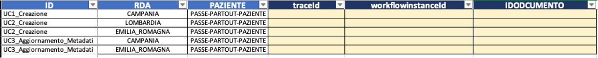

## Introduzione 
Il **crash program** è un'iniziativa strategica volta a migliorare l'efficienza e l'affidabilità delle interazioni tra i servizi ICT regionali e i sistemi nazionali di gestione dei dati sanitari. 
Questo programma si concentra sulla standardizzazione e sull'automatizzazione dei processi di scambio dati, garantendo una maggiore sicurezza e una riduzione degli errori umani. 

In questo contesto, il responsabile dei servizi ICT Regionale o di un document repository svolge un ruolo cruciale. Egli invia una comunicazione all'indirizzo email aaaa@bbbb.it esprimendo la volontà di aderire al **crash program**. Attraverso l'automatizzazione delle richieste dal Middleware Regionale (MDW) verso il Gateway (GTW), si garantisce un processo continuo e affidabile che può essere adattato alle esigenze di una crescente rete di regioni e di partecipanti.
  
L'obiettivo finale del **crash program** è quello di costruire un'infrastruttura robusta e affidabile per la gestione dei dati sanitari, migliorando la qualità del servizio e la sicurezza dei dati per i cittadini, e fornendo una base solida per future espansioni e miglioramenti tecnologici.

## Prerequisiti
Il responsabile del sistema da sottomettere al **crash program** dovrà inviare una mail alla casella di posta [aaaa@bbb.it](mailto:aaaaa@bbb.it) fornendo la lista delle informazioni:
:::note[Esempio di invio email per middleware]
**to**: aaaa@bbb.it  
**subject**: Adesione crash program MDW Regione X  
Io sottoscritto Mario Rossi, desidero aderire al crash program. Di seguito i riferimenti da utilizzare:  
**Paziente**: GCMVRD92X19L259X(Giacomo Verdi)   
**Cn**: A1#1234TEST  
**Middleware**: SI  
**Email referente**: referenteMDW@test.it  
:::

:::note[Esempio di invio email per non middleware]
**to**: aaaa@bbb.it  
**subject**: Adesione crash program MDW Regione X  
Io sottoscritto Mario Rossi, desidero aderire al crash program. Di seguito i riferimenti da utilizzare:  
**Paziente**: GCMVRD92X19L259X(Giacomo Verdi)   
**Cn**: A1#1234TEST  
**Middleware**: NO  
**Email referente**: referenteMDW@test.it  
**Document repository**: ASL_NA_3_SUD
:::

La richiesta verrà presa in carico dall'operational che al termine delle opportune verifiche fornirà un feedback circa l'avvenuto censimento.

## Automatizzazione delle Richieste
Per garantire una soluzione che risulti significativamente scalabile, è consigliato che ogni singolo partecipante sviluppi un client in grado di interfacciarsi con il Gateway in maniera automatica. Questo client dovrebbe essere progettato per gestire in maniera efficiente una lista dinamica di codici fiscali, i quali appartengono a cittadini dislocati in varie regioni geografiche.

In generale si richiede che vengano automatizze le chiamate presenti nel [documento di integrazione Gateway](https://github.com/ministero-salute/it-fse-support/tree/main/doc/integrazione-gateway) .  
I diversi attori verranno informati quando vi sarà un nuovo censimento che entrerà a far parte della comunity del **crash program**

:::note[Esempio di automatizzazione]
Il meccanismo di aggiornamento potrebbe essere impostato, ad esempio,con un test automatico che iterando su una lista configurabile di pazienti esegue il test per ognuno. Tale configurabilità permetterà così una maggiore estendibilità.
:::

:::caution[Nessuna automazione]
Se le diverse chiamante non venissero automatizzate la scalabilità verrebbe fortemente ridotta al punto che non converrebbe più eseguire l'esecuzione delle chiamate.
:::

## Processo Batch automatico
Il processo automatico sarà realizzato da due batch che lavoreranno a stretto contatto.  
Il primo avrà la responsabilità di spazzolare le diverse collection dell'ambiente di validazione identificando così le diverse chiamate eseguite dai processi automatici censiti. L'output di tale processo sarà la compilazione di un excel che avrà il formato seguente 
 

Il secondo invece avrà la responsabilità di effettuare le verifiche di coerenza metadati rispetto a ciò che è stato inviato alla RDA di riferimento.
 
## Gestione degli Errori
Qualora il processo automatico dovesse terminare una scansione con degli errori in automatico verrà aperta una issue sull'apposito repository github con il tag **ISSUE_CRASH_PROGRAM** informando i referenti.n