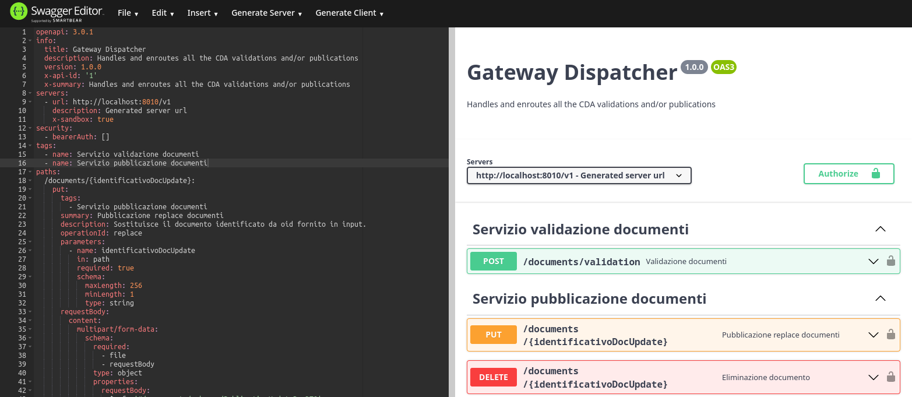

# OPENAPI

Questa directory contiene il file yaml con la definizione openapi dei servizi esposti dal Gateway.

---  

Per una visualizzazione grafica è possibile usare l'[editor swagger](https://editor.swagger.io).  
È sufficiente copiare il contenuto del file da questo [link](https://github.com/ministero-salute/it-fse-support/raw/main/openapi/gateway/swagger_gtw.yaml) e incollarlo all'interno della parte sinistra della finestra dell'editor.

